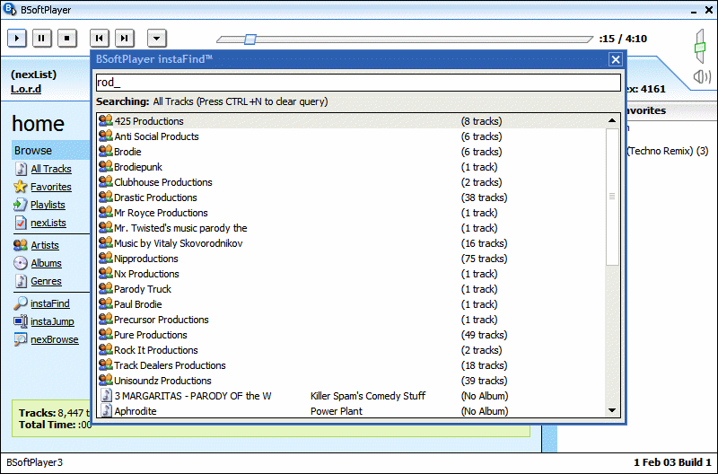



## Updated Feb 03: BSoftPlayer3 \- Database Powered Media Player

### Description

From the creator of BoS and B2 comes BSoftPlayer3, a very fast MP3 player (handles 10,000+ tracks easily and still starts in <4 seconds). Built on MySQL; it allows you to define custom queries. Automatically imports new files and updates or removes deleted or changed files. Supports ID3v1 and ID3v2. Various playback modes including shuffle and artist/album.
 
### More Info
 

             |
---                |---
**Submitted On**   |
**By**             |[Brian Cairns](https://github.com/Planet-Source-Code/PSCIndex/blob/master/ByAuthor/brian-cairns.md)
**Level**          |Advanced
**User Rating**    |4.9 (64 globes from 13 users)
**Compatibility**  |VB 6\.0
**Category**       |[Sound/MP3](https://github.com/Planet-Source-Code/PSCIndex/blob/master/ByCategory/sound-mp3__1-45.md)
**World**          |[Visual Basic](https://github.com/Planet-Source-Code/PSCIndex/blob/master/ByWorld/visual-basic.md)
**Archive File**   |

### Source Code

<b>The best VB music player, possibly the best media player period</b>  
That's a pretty bold statement, isn't it? What do I have to back it up? I have the fastest, most advanced VB music player. Built on the mySQL database server, it can handle 1-10,000 tracks or more, still take under 25M of memory, still start in under four seconds, and still remain very responsive.  Featrues include: - ID3v1 and ID3v2 support, as well as basic WMA tag support - Complete organizing of tracks into artists, albums, and genres - Advanced multi-criteria browser (similar to Winamp3's media library but faster and with 3 criteria) - Micro mode that still remains extremly usable - Random, artist, album, and title play order - User definable automatically updating playlists (nexLists) using SQL syntax - Full search, including multi-word search ("blue group" finds "blue man group") - Instantly jump to any track based on a track number (instaJump) - Instant find of any track by title, artist, album, or filename - Automatic importing of user specified directory (optional) - Automatic removal of deleted tracks - Automatic update of tracks - Easy to use, graphical interface - User definable keyboard shortcuts that work while in most applications - OGG Vorbis compatable with DirectShow filter - Complete installer and uninstaller - Imports directories recursively or nonrecursively - Fully usable (interactive) while importing or updating tracks - Favorites - Rating (requires use of nexLists to view ratings)  -Play counts (requires use of nexLists to view play counts)  
<a href="http://bsoft.home.attbi.com/bspsource.zip">BSoftPlayer3 Source Code</a> 
<a href="http://bsoft.home.attbi.com/bspsetup.exe">Installer and All Required DLLs/OCXs</a> (recommended) 
<a href="http://www.mysql.com/downloads/download.php?file=Downloads%2FMySQL-4.0%2Fmysql-4.0.9-gamma-win.zip&mirror=http%3A%2F%2Fmysql.secsup.org%2F">MySQL Database Server 4.0.9</a> (required to use BSoftPlayer)  
<b>Some Notes:</b> BSoftPlayer3 is currently in the Prerelease phase. It is stable but does not have all of the features implemented. You may have to restart after installing MySQL.  BSoftPlayer3 is released under the GNU General Public Liscence. See <a href="http://www.fsf.org/licenses/gpl.html">http://www.fsf.org/licenses/gpl.html</a> for details.  <b>Updated version 3.01:</b> This is version 3.01. New features include working genre support, working paging in albums, genres, and tracks, working search, working instaBrowse, updated shuffle mode (truly random this time), and filename searching in instaFind. 

